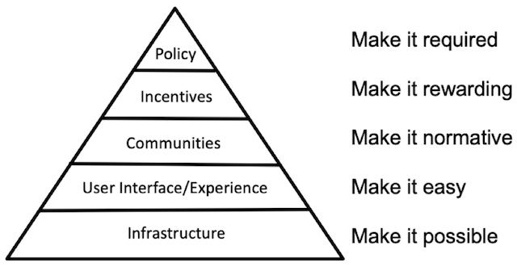
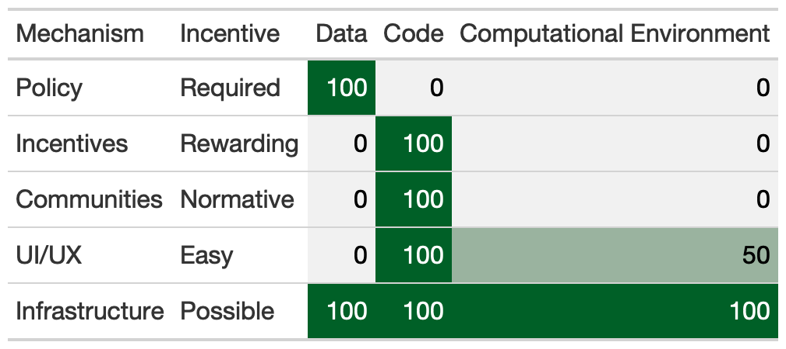
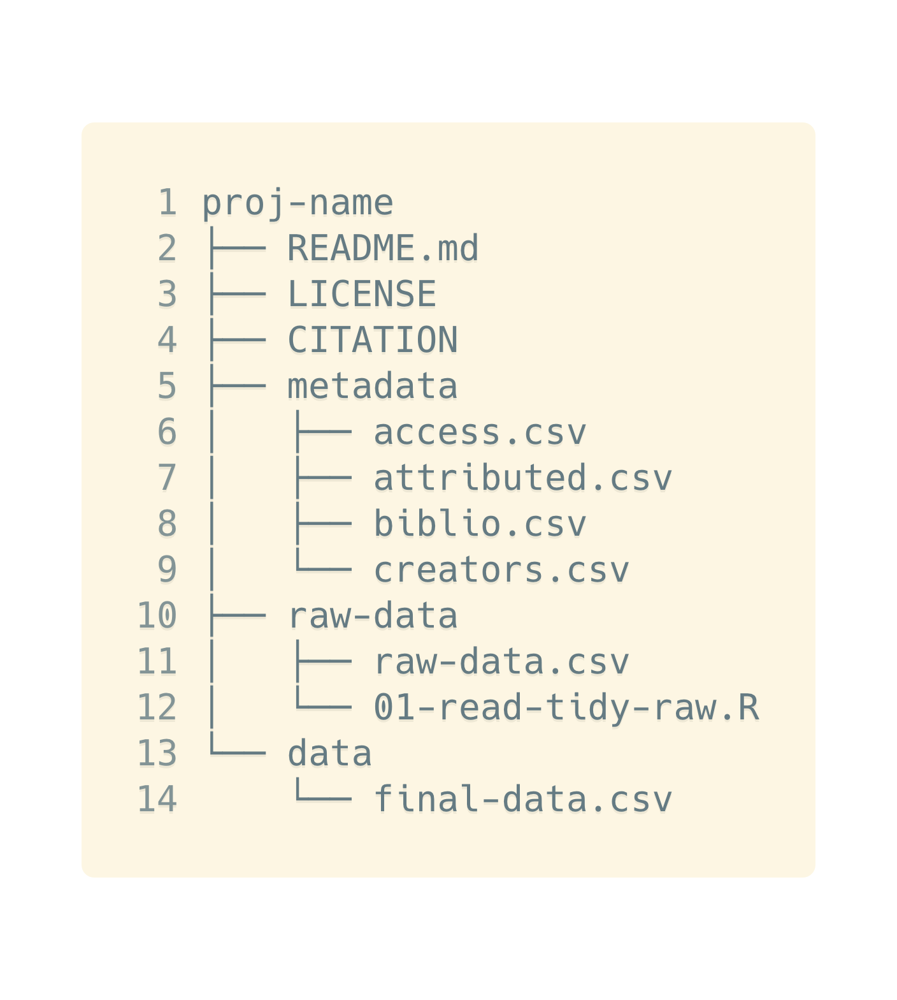
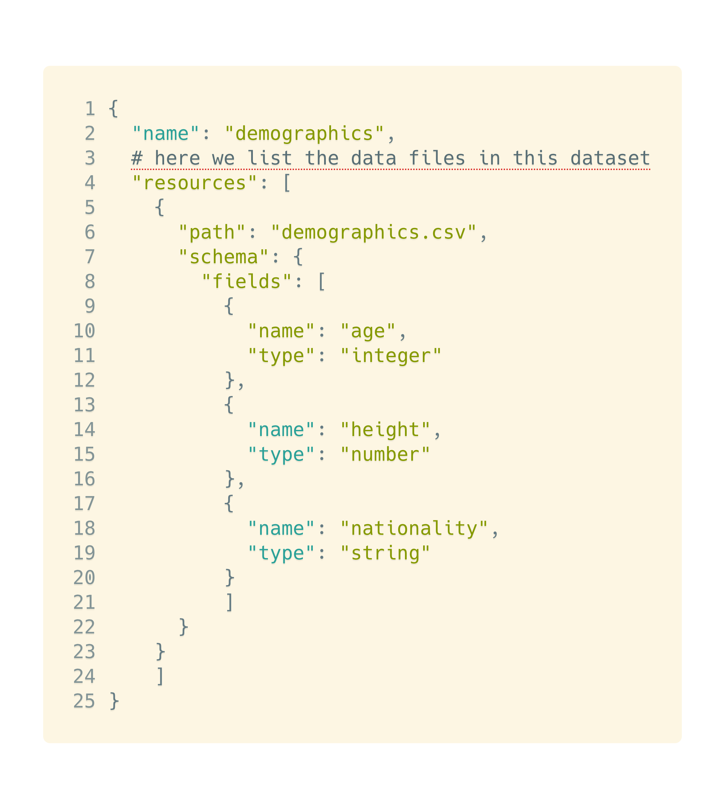

```{=tex}
\begin{singlespace}

1 = Monash University, Department of Econometrics and Business Statistics, Melbourne, Australia

2 = Australian Centre of Excellence for Mathematical and Statistical Frontiers (ACEMS)

3 = Berkeley Institute for Data Science, University of California, Berkeley, USA

* = Both authors contributed equally to the work

Correspondence to:

Nicholas Tierney (nicholas.tierney@gmail.com) and Karthik Ram (k@karthik.io)

\end{singlespace}
```
# Abstract {.unnumbered}

```{=tex}
\begin{singlespace}

Data makes science possible. Sharing data improves visibility, and makes the research process transparent. This increases trust in the work, and allows for independent reproduction of results. However, a large proportion of data from published research is often only available to the original authors. Despite the obvious benefits of sharing data, and scientists' advocating for the importance of sharing data, most advice on sharing data discusses its broader benefits, rather than the practical considerations of sharing. This paper provides practical, actionable advice on how to actually share data alongside research with minimal barriers.

\end{singlespace}
```
```{r setup, echo = FALSE}

knitr::opts_chunk$set(echo = FALSE,
                      out.width = "60%",
                      fig.align = "center")

suppressMessages(library(ggrepel))
suppressMessages(library(tibble))
suppressMessages(library(kableExtra))
suppressMessages(library(magick))
suppressMessages(library(ggplot2))
suppressMessages(library(cowplot))
suppressMessages(library(gridExtra))
```

# Introduction {#intro}

> "Data! data! data!" he cried impatiently. "I can't make bricks without clay." - Sherlock Holmes (The Adventure of the Copper Beeches by Sir Arthur Conan Doyle)

The idea of open and transparent science dates back to the founding principles of The Royal Society of London in 1660. The movement, which has seen shifting support over the years, has enjoyed growing popularity over the past decade [@Nielsen2020; @Peng2011] mainly among early career researchers [@McKiernan2016]. A key motivation for practicing openness is the notion that sharing all research artifacts will allow others to reproduce and verify results, thereby improving trust and verification of those findings. Jon Clarebout famously wrote in 1992 that reproducibility in computationally oriented fields had become so trivial that non experts could do the task. Clarebout's optimistic vision was a little ahead of its time as the tools and technologies available in the early nineties for literate programming presented too high of a barrier for most researchers to adopt without incurring a significant loss in productivity [@Barnes2010].

Meaningful progress on computational reproducibility, the ability of an independent researcher to recreate figures, tables and key findings, became more of a practical reality in the late 2000s as new tools and services came into existence. Scientists started sharing more code and software, partly due to the rapid increase in training opportunities made possible by organizations like The Carpentries, combined with the growing adoption of Github by scientists [@Ram2013; @Zagalsky2015]. The bigger driver for this is more likely driven by the growing popularity of data science as a discipline distinct from statistics [@Donoho2017]. This rapid growth in data science has been catalyzed by a Cambrianesque explosion of open source software tools. Programming languages such as Python, R and Julia have helped scientists implement and share new methods to work with data [@rcore; @python; @julia]. Each of these languages enjoys support of thriving communities of researchers and software developers who contribute many of the building blocks that make them popular. Modern scientists now have access to many interactive computational frameworks (e.g. Jupyter, RMarkdown, Stencila, Observable) that can interact with kernels from dozens of programming languages. Beyond notebooks to run the code, a reader will also require access to the same software dependencies. In a study of applied computational research, [@Collberg2014] and colleagues were only able to install and run less than 20% of the software described in publications. In addition to locating software, one still has to install the right versions. Although this problem is far from solved, technologies like Docker have alleviated some of these concerns. Researchers can share Dockerfiles to recreate computational environments [@Boettiger2015]. Services like Binder can then leverage Docker and make possible to share the computational environments in which these notebooks were run. The barriers to verification are now low enough that trivial reproducibility is sometimes a click away, free from the misery of software installation [@Jupyter2018].

Notebooks however, are an incomplete solution for computational reproducibility. For a piece of computational research to be minimally reproducible, it requires three distinct elements: 1) Code; 2) Computing environment, and 3) Data. There has been tremendous progress on the first two, despite some limitations of existing tools and practices [@Poisot2019]. While it took nearly two decades for Clarebout's vision to become reality, improvements in technology and motivations played a strong role in the culture change. Sharing code wasn't just easy at first [@Barnes2010], but became a social and normative part of academic culture. The next stage of this evolution, turning code into software, also became popular with increasing training opportunities [@Wilson2014; @Teal2015], tooling [@devtools], and recognition as a scholarly contribution [@Smith2018]. Getting researchers to share usable data has been more of a struggle.

```{r pyramid, fig.cap = "Strategy for culture and behavior change, taken from the Center for Open Science: https://www.cos.io/blog/strategy-for-culture-change . To reach the top, all the lower levels need to be adequately achieved."}
# pyramid image

```

```{r incentable-table, fig.cap = "Table of the mechanism for behavior change, the incentive, and our assessment of where the elements of Data, Code, and Computational Environment rank in terms of completing these aspects. We note that Data is often required, but the preceding steps are not required. This is in contrast to Code having no policy"}
library(gt)
incentive_table <- tibble(
  Mechanism = c("Policy", "Incentives", "Communities", "UI/UX", "Infrastructure"),
  Incentive = c("Required", "Rewarding", "Normative", "Easy", "Possible"),
  Data = c(100, 0, 0, 0, 100),
  Code = c(0, rep(100, 4)),
  `Computational Environment` = c(0, 0, 0, 50, 100)
  )

incentive_table %>%
  gt() %>%
  data_color(
    columns = vars(Data, Code, `Computational Environment`),
    colors = scales::col_numeric(
      # Using a function from paletteer to generate a vector of colors
      # Note that you need to wrap paletteer_d outputs in as.character()
      palette = colorspace::sequential_hcl(n = 3, palette = "Greens2", rev = TRUE),
      # Domain is from scales::col_numeric
      # Domain = The possible values that can be mapped
      # We don't HAVE to set a range for this since
      # we're using it inside data_color()
      domain = NULL
    )
  ) %>%
  gtsave("figures/gt-incentive-table.png")

# 
```

Nosek [-@Nosek2019] describes the strategies for culture change, especially when the status quo is too entrenched. Beyond motivation, skills, tools, and incentives are critical to enable such change. In a five step process, Nosek describes how achieving lasting culture change requires us to show proof of concept that an activity is possible, then improve the infrastructure to make it easy, then increase awareness to make it normative. Once there is a critical mass, find ways to reward those who put it into practice. After these steps, it would then be possible to require this of everyone Figure 1, table 1). This framework provides a useful lens through which to examine adoption of code, computational environments and data for reproducibility. With code, we have slowly progressed through these stages. While no journals require that authors share code, the venues to share, along with the necessary training have paved the way for incentives and credit. All of the necessary foundation to make code sharing required are in place. For computational environments, Docker makes it possible to share them in most common use cases [@Boettiger2015]. But running them still requires expertise and time on the part of reviewers. More recent open services like Binder [@Jupyter2018] make it possible to run notebooks atop Docker images, but the technology is still new and slowly gaining adoption. There is still a long way to go before sharing computational environments in academia becomes mainstream. Finally, for data, we have implemented these steps out of order. The FAIR data principles were introduced in 2016 with good intentions [@Wilkinson2016] and describe the desired attributes for research data. That they be findable (good metadata), accessible (deposited somewhere persistent), interoperable (easily combined with other datasets), and be reusable. We as a community started out by making data required before demonstrating how this would directly benefit those who share data. Researchers are asked to deposit their data in one of many institutional or commercial repositories. Many journals even require it as a condition for publication via policy. However, the cost of preparing data for reuse remains high, and the career incentives to do so are almost non-existent. Until we make data reuse easier and more rewarding, no level of policy is going to improve the state of data sharing.

Despite the increase in data being shared alongside publications [@Culina2020], the status quo of data sharing in science is not good. [@Rowhani-Farid2016] showed that 7 of 157 (4.5%) sampled papers in the British Medical Journal shared data, and only 14% of articles claiming open sharing of data actually shared their data. Similarly, [@Stodden2018] showed only 36% of papers in the journal *Science* shared data, despite the Journal's data sharing policy. [@Colavizza2020] reflects similar findings for PLOS and BMC journals. There are numerous examples of similar problems in other fields, such as psychology, biology, and bioinformatics. The reality is that while data sharing is increasing in many fields such as ecology, the amount of data that can be reused is likely lower [@Culina2020] . To make shared data useful, we need to realign incentives for researchers.

Tools to prepare datasets and metadata (*the infrastructure*) and best practices (guidelines) for reuse are sparse [@Arslan2019; @Roche2015]. Unlike code, datasets are far more diverse in terms of heterogeneity, size, and formats. This makes them particularly challenging to standardize or easily "install" where the code is running. There are some efforts working towards improving this process, such as gogetdata , the 'dat' project, and a private company, Quilt [@goget; @dat; @quilt].

Depositing data with rich metadata is laborious making it a pro forma activity outside of speciality repositories like Dryad that employ curators. Lastly, the infrastructure to track and get credit for data is non-existent. Datasets currently do not accrue citation credit since they are not tracked.

## Improving the state of reusable data sharing

As academic data scientists, we spend considerable time cleaning messy data and believe that preparing data for easy reuse can be a catalyst to improve the quality of data and pave the way for other incentives such as community adoptions, which will then create the culture change needed to credit data similar to publications. In this note, we describe a set of practices that researchers can adopt to make data more useful in the context of reproducibility. It should not be a huge burden to share data in a format that is readily usable by others. And similarly, this burden should be reduced by those who want to use another's data.

To make data more reusable, we need to make it easier to generate metadata, standardise good practices within and across communities, and make reusable data sharing a recognized, normalised, part of research. Here we present a set of best practices to enable this change. These include documentation (\@ref(documentation-readmes)), licensing (\@ref(licences)), citation (\@ref(citation-how-you-want-your-data-to-be-cited)), code (\@ref(data-as-part-of-open-source-packages)), raw and analysis ready data (\@ref(raw-data-vs-analysis-read-data)). We also discuss considerations for sharing of data of various sizes \@ref(considerations-for-data-size).

# Documentation (READMEs) {#readme}

A README is often the first place users will look to learn more about a directory [@Prana2019]. The README is a concise text file containing guidance on how to read and interpret the directory - the who, what, when, where, and how (<https://betta.io/blog/2017/02/07/developer-experience-github-readmes/> and [@Prana2019]. For example, a README in a data repository might explain which directories contain data, tidying scripts, and also why data was collected. The README should be placed in the top level of the project, and there can be multiple README files in a project. In the context of datasets, READMEs are particularly useful when there are no reliable standards.

# Licences {#licenses}

A license for data clearly establishes the rules for its use, and whether it can be modified or shared. Without a license, or with a non-standard license, these rules are unclear, and lead to issues with use, attribution and citation. We recommend using a license from Creative Commons (<https://creativecommons.org/>), specifically, we recommend CCBY and CC0 as they are commonly used, and provide simple rules for attribution, warranty, and use. We recommend against non-standard licenses, such as those custom written by the authors, as some terms can render them unusable. Once a license is chosen, a LICENSE file should be provided, containing the entire license in the top level of the directory. The license type should be mentioned in the README, if used.

CC BY requires appropriate credit and attribution, but data can be shared and adapted, even for commercial use, provided changes are described. The CC0 is a "public domain" license, meaning data owners waive all rights, and the work is now "owned" by the public. CC0 data can be freely shared, copied, modified, and distributed, even for commercial purposes **without asking permission**. When using data with CC0, it is good practice to cite the original work, but is not required. Both CCBY and CC0 provide no warranty. Brief and full overviews of CCBY and CC0 can be found at [@ccby-short; @ccby-long; @cc0-short; @cc0-long].

Some data repositories and journals will automatically require a license when submitting data. For example, Dryad requires CC0 (<https://blog.datadryad.org/2011/10/05/why-does-dryad-use-cc0/> and <https://datadryad.org/stash/faq>) and the journal PLOS Comp Bio, requires licences for data that are not more restrictive than CC BY [@plos-comp-bio-data].

```{r dir-layout, fig.cap = "Example directory layout and structure for sharing data. Note ..."}
# insert carbon.sh figure showing file structure layout

```

# Metadata {#metadata}

There are three benefits to a dataset having metadata: (1) They provide context by describing variables to humans; (2) They avoid errors by describing and preserving variable types for machine readability; (3) They make data easier to find online by facilitating indexing [@google-data-search]. Three pieces of metadata should be considered: (1) **variable names**, (2) **variable descriptions**, and (3) **unit text**. These should be curated by a person. Metadata created should be clearly labelled in a folder or in files named METADATA.

**Variable names** are short, descriptive names with no spaces or special characters, such as "job\_position" or "date". **Variable description** describes the measured variables, e.g., "University Job Position" or "Date Started", and should also define *variable codes* and *missing data*. **Unit text** defines the type of variable recorded (e.g., string, date, numeric, integer), and avoids serious errors of misrepresented data (e.g., a column of a gene sequence being interpreted as a date). For more details on this we recommend reading [@Broman2017; @Ellis2017; @Arslan2019].

Metadata should provided in plain text files following a standard format. Such formats include the Ecological Metadata Language [@EML-about] (EML), which uses XML (The eXtensible Markup Language), and Table Schema, which uses JSON-LD (Java Script Object Notation - Linked Data) \@ref(fig:json-ld). One implementation of this is Frictionless Data [@Fowler2017], which provides a language agnostic way to document data - to learn more see <https://frictionlessdata.io/guide/>.

EML is widely used in Ecology (for example [@Maerz2014]). JSON-LD provides advantages over EML, by having fields to facilitate data discovery with google dataset search [@EML-data]. We recommend JSON-LD over EML, as it is more human readable, shorter, and quicker and easier to read and write. For more information on tooling to assist generating metadata, see <https://knb.ecoinformatics.org/tools/morpho> and [@Arslan2019].

```{r json-ld, fig.cap = "Example snippet of some Table Schema data for a dataset with three variables. This provides a description of each field, and the type of field."}

```

# Raw data vs analysis read data {#rawdata}

Raw data is the first format of data provided before any cleaning has taken place (e.g., data in some binary or proprietary format). It should be placed in its own folder. Data used in analysis should be provided, especially if computationally intense to derive. It should be in its own folder, and to maximise interoperability, recorded in a plain text (e.g., csv, tsv), not a binary format (e.g., .rds, .sav, .xlsx). Ideally data should be in "Tidy Data" form, where variables are in columns, observations in rows, and each cell has only one value [@Wickham2014].

We don't have particular recommendations for non tabular of data, like binary images, but given the ubiquity of tables in papers, these recommendations will be broadly useful. For other data formats we recommend using a copy of the most robust common format and avoid the latest tools that may be more brittle and likely to change in the future. For example, for an image, a TIFF image in addition to a custom photoshop file.

# Data cleaning scripts {#scripts}

Code used to transform data from its raw format into analysis ready form should be kept in the same place as raw data (Section \@ref(fig:dir-layout)). Ideally, this transformation should involve only scripted languages (e.g, R, Python, Matlab, etc), but any non-scripted data preparation steps should be recorded in a plain text file.

# Citation: How you want your data to be cited {#cite}

Citation is important for provenance, and credit. Citing data clarifies the data version used (provenance), and provides authors a citation (credit). To ensure these are provided, data needs to have an accession number, such as a Digital Object Identifier (DOI). A DOI is a permanent, unique identifier for a digital object such as a paper, poster, or software, and is a prerequisite for citation. If a DOI or accession number is unavailable, a citation will be meaningless, as it cannot be tracked by any means. A file named CITATION should be placed in the directory at the top level. It should contain a DOI, and could be in `.bibtex` format - \@ref(fig:dir-layout). Avenues that provide DOIs are discussed in \@ref(avenues-to-share-data)].

# Avenues to share data {#avenues}

There are different avenues to share data, and although the terms are sometimes used interchangeably, they are, in fact, different. These include: (1) Data sharing: Making data publicly available; (2) Data archiving: Depositing data somewhere permanent; (3) Data publishing: writing a paper to explain the archived data.

As discussed in \@ref(citation-how-you-want-your-data-to-be-cited), we recommend data are archived using a platform that generates an accession number such as a DOI. For sharing data collected for research, the most relevant homes are the research data repositories **zenodo**, **dryad**, or **Open Science Framework** (OSF). In addition to minting DOIs, they also provide citation templates that can be used in \@ref(citation-how-you-want-your-data-to-be-cited).

Zenodo can be contacted to arrange special cases for storage of large data. Special hosting can be arranged via specially contacting zenodo or your research institute. If using a research institute's library service to share data, ensure a DOI is provided so it can be accurately identified and cited.

There are many alternatives to these three, for example, an astronomy project may host its data at the Sloan Digital Sky Survey (SDSS), and genetic data can be hosted at GenBank [@GenBank]. Importantly, these all provide some form of accession number. We recommend adhering to community standards when deciding where to publish data, as this will likely improve data reuse. Large data may also be shared via domain specific venues (e.g., in genomics or astronomy), where appropriate.

We recommend against depositing data in local file storage that does not provide DOI or accession numbers. For example, [@50Hectares] is hosted on a university server and accessed via FTP. It is not possible to effectively provide effective provenance and credit.

Although it is fine to share data among collaborators using temporary cloud storage (like Dropbox, Google Drive), once the paper is public, the data needs to be hosted somewhere persistent. While this approach is useful while iterating on the paper, it does not scale to a larger readership and is highly prone to disappearing (lack of permissions, etc). Just archive the data.

Journals provide data papers, where they provide a formal publication explaining data that is archived. This is a familiar avenue for researchers to receive credit and citation. Writing a data paper can be very useful for researchers, however, data papers lack guidelines on how to structure data for effective reuse and sharing. We recommend partnering with [@dryad] to archive data and link it with research papers, as they provide a person to help curate your data, improving usability.

# Data as part of open source packages {#pkgs}

Data can be distributed alongside code using a format such as a package in R, Python, and Julia [@nycflights; @horst-penguins; @data-python-pkg; @r-data-julia]. A package or module structure provides an advantage as it can be "installed" and loaded just like code. Despite the advantages of sharing data as a software package, there are a few major disadvantages. Firstly, packaging data inside a software package makes the data availability language centric. Users who work in other languages are unlikely to download and export data out of a package. Secondly, data size can be a limitation depending on the repository (CRAN, the R repository, for example, limits package sizes to 5mb although there are workarounds [@Brooke_Anderson2017]). Other fields, such as bioinformatics have a process of sharing data through repositories like Bioconductor, with larger data size. Thirdly, there is the cost of authors and data curators/custodians understanding intricacies of package development in order to share data.

Packaged data and archival on venues like Zenodo are not mutually exclusive. We recommend researchers first archive data in a long-term data repository (Section \@ref(avenues-to-share-data)), before including it in a package. This makes the data easily citable wherever data is referenced.

# Considerations for data size {#size}

How data is shared can change depending on its size. Defining data size will always be somewhat ill-defined, since storage capacity and norms constantly change. We consider data sizes in reference to a moderately priced laptop, where small data fits on computer memory (RAM), medium data does not fit on RAM, and big data does not fit on the hard disk. No matter the size, the data should be archived with an accession number or DOI.

Small data has more options in how it is shared - you can bundle it with your analysis code (as in \@ref(raw-data-vs-analysis-read-data)), or in software \@ref(data-as-part-of-open-source-packages). For medium data, consider a venue like zenodo for archiving. Sharing medium data might require it to be broken into separate chunks for reading (e.g., `teaching-1.csv`, `teaching-2.csv`, etc.), and scripts provided to read it. Large data will require liaising with services from \@ref(avenues-to-share-data), or local research institute library to make special arrangements, to ensure there is some way to gain access, and also maintain a DOI.

# Conclusion

Although data sharing is widely mandated by funders, journals, and academic societies, the amount of usable data remains appallingly low. The mere act of depositing data does not make it reusable or useful to a potential reader. Although data citations do not currently impact promotion and tenure packets, there is anecdotal evidence that papers sharing usable data accrue more citations [@Piwowar2007]. Over time, the more useful we make the data, the more likely incentive mechanisms will take hold.

The steps leading up to requiring data sharing are still vague and disincentivized. In comparison, although few journals require that code be submitted with publications, it is more likely to be adopted given the foundation we have put in place. We have taught researchers how to write modular code via popular training initiatives such as The Carpentries. Commercial tools like GitHub have made code sharing fun and productive. For more advanced researchers, data science languages have made it easier to package and disseminate code as software. If we now require mandatory code sharing, it is quite likely that more of it will be useful than the data currently being shared.

To make data sharing truly useful, we need to make the process easier, improve tools and training, then reward and incentivize researchers who engage in such practices. Only then can data truly be useful.

# Acknowledgements {.unnumbered}

We'd like to thank the following people for helpful discussions and contributions to the paper as we were preparing it for publication: Anna Krystalli, Daniella Lowenberg, and Miles McBain. We'd also like to thank those who provided feedback on the paper when it went up for presubmission: Adrian Barnett, Raymond B Huey, Christian Thurn, Christina Maimone, and github user, 'dschief001'. Finally, we thank the following organisations for their support ACEMS International Mobility Programme, the Helmsley Charitable Trust, the Gordon and Betty Moore Foundation, and the Sloan Foundation.

# Literature Cited {.unnumbered}

::: {#refs}
:::

\newpage

# Bigger Picture Statement {.unnumbered}

Without data, there is no science. Science needs to be reproducible so we can trust the results, and progress as a field. But without data, we do not have true reproducibility. Currently, the role of data in reproducibility is not adequately discussed. We believe this is in part because discussions around data are centered around both data quality and data sharing. However, these are in fact two separate (but related) topics. We provide immediately usable guidelines to sharing data alongside your research, with minimal barriers, that a researcher could pick up and use today.

In the future, we hope that the culture around data sharing will change, and sharing data will be rewarded in science. We want the new normal to be an expectation of data to be submitted with every research publication, and for these datasets to be easily discovered, shared, and extended in other analysis.

# Bio {.unnumbered}

**Nicholas Tierney**

Nicholas Tierney has an honours degree in Psychological Science, and a PhD in Statistics. He is a Lecturer at Monash University, teaching introduction to data analysis. His ranges from exploratory data analysis, to statistical modelling, calculating diagnostics, and how we draw inferences, and make decisions from data. Crucial to this work is producing high quality software to accompany each research idea. Nick is a keen outdoorsman, and loves hiking, trail running, rock climbing, photography, and making coffee.

**Karthik Ram**

Karthik is a senior data scientist at the Berkeley Institute of Data Science and a co-founder of the rOpenSci project. Karthik is also a senior PI at the Berkeley Initiative for Global Change Biology. Prior to joining Berkeley, he earned his PhD in Ecology & Evolution from the University of California, Davis. Karthik's interests are focused on reproducible research, especially as it applies to global change. Much of his recent work focuses on building tools and services around open data and growing diverse data science communities.
