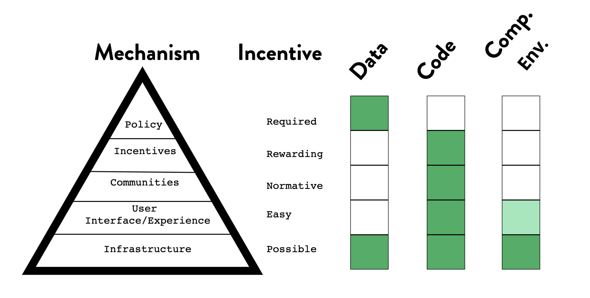

```{=tex}
\begin{singlespace}
1 = Monash University, Department of Econometrics and Business Statistics, Melbourne, Australia\\
2 = Australian Centre of Excellence for Mathematical and Statistical Frontiers (ACEMS)\\
3 = Telethon Kids Institute, Perth Children's Hospital, Perth, Australia\\
4 = Berkeley Institute for Data Science, University of California, Berkeley, USA\\
* = Both authors contributed equally to the work\\
Correspondence to:\\
Nicholas Tierney (nicholas.tierney@gmail.com) and Karthik Ram (karthik.ram@berkeley.edu)

\end{singlespace}
```


<!-- Other titles under consideration: -->
<!-- Barriers to meaningful data sharing -->
<!-- - Meaningful data sharing -->
<!-- - Data sharing practices to realign incentives and enable positive/meaningful culture change\\ -->
<!-- - Enabling culture change for meaningful data sharing\\ -->
<!-- - Principles of sharing data\\ -->
<!-- - Elements of meaningful data sharing\\ -->
<!-- - The biggest barrier to widespread data sharing are incentives and infrastructure.\\ -->
<!-- - Some practical guidance on improving data reuse.\\ -->


# Abstract {.unnumbered}

```{=tex}
\begin{singlespace}
There are numerous arguments that strongly support practice of open science, with societal and individual benefits. For individual researchers, sharing research artifacts such as data can improve trust and transparency, reproducibility of one's own work, and catalyze new collaborations. Despite the general appreciation of the benefits of data sharing, research data are often only available to original investigators. For data that are shared, lack of useful metadata and documentation make them challenging to reuse. In this commentary we argue that incentives and infrastructure for making data useful are the biggest barrier to creating a culture of widespread data sharing. We compare data to code, and computational environments in the context of reproducible research and provide some practical guidance on how one can improve the chances of their data being reusable and partially bridge the incentive gap.

\end{singlespace}
```
```{r setup, echo = FALSE}

knitr::opts_chunk$set(echo = FALSE,
                      out.width = "60%",
                      fig.align = "center")

suppressMessages(library(ggrepel))
suppressMessages(library(tibble))
suppressMessages(library(kableExtra))
suppressMessages(library(magick))
suppressMessages(library(ggplot2))
suppressMessages(library(cowplot))
suppressMessages(library(gridExtra))
```

# Introduction {#intro}

> "Data! data! data!" he cried impatiently. "I can't make bricks without clay." - Sherlock Holmes (The Adventure of the Copper Beeches by Sir Arthur Conan Doyle)

The idea of open and transparent science dates back to the founding principles of The Royal Society of London in 1660. The movement, which has seen shifting support over the years, has enjoyed growing popularity over the past decade [@Nielsen2020; @Peng2011] mainly among early career researchers [@McKiernan2016]. A key motivation for practicing openness is the notion that sharing all research artifacts will allow others to reproduce and verify results, thereby improving trust and verification of those findings. Jon Clarebout famously wrote in 1992 that reproducibility in computationally oriented fields had become so trivial that non experts could do the task. Clarebout's optimistic vision was a little ahead of its time as the tools and technologies available in the early nineties for literate programming presented too high of a barrier for most researchers to adopt without incurring a significant loss in productivity [@Barnes2010].

Meaningful progress on most computational reproducibility, the ability of an independent researcher to recreate figures, tables and key findings, became more of a practical reality in the late 2000s as new tools and services came into existence. Scientists started sharing more code and software, partly due to the rapid increase in training opportunities made possible by efforts like The Carpentries, combined with the growing adoption of GitHub by scientists [@Ram2013; @Zagalsky2015]. The bigger driver for this is more likely due to the growing popularity of data science as a discipline distinct from statistics [@Donoho2017]. This rapid growth in data science has been catalyzed by a Cambrianesque explosion of open source software tools. Programming languages such as Python, R and Julia have helped scientists implement and share new methods to work with data. Each of these languages enjoys support of thriving communities of researchers and software developers who contribute many of the building blocks that make them popular. Modern scientists now have access to many interactive computational frameworks (e.g. Jupyter, RMarkdown, Stencila, Observable) that can interface with kernels from dozens of programming languages. Beyond notebooks to run the code, a reader will also require access to the same software dependencies. In a study of applied computational research, less than 20% of software described in publications was able to be installed and run [@Collberg2014]. In addition to locating software, one still has to locate the right versions. Dependency management is a controversial topic in programming communities with no easy solutions. While languages like JavaScript have solved this with package managers like npm, it is much harder to accomplish in others like Python and R which are currently supported by a patchwork of solutions. Although this problem is far from solved, technologies like Docker have alleviated some of these concerns. Researchers can share Dockerfiles to recreate computational environments [@Boettiger2015]. Services like Binder can then leverage Docker and make it possible to share the computational environments in which these notebooks were run. The barriers to verification are now low enough that trivial reproducibility is sometimes a click away, free from the misery of software installation [@Jupyter2018].

Notebooks however, are an incomplete solution for computational reproducibility. For a piece of computational research to be minimally reproducible, it requires three distinct elements: 1) Code; 2) Computing environment, and 3) Data. There has been tremendous progress on the first two, despite some limitations of existing tools and practices. While it took nearly two decades for Clarebout's vision to become reality, improvements in technology and motivations played a strong role in the culture change. Sharing code wasn't just easy at first [@Barnes2010], but became a social and normative part of academic culture. The next stage of this evolution, turning code into software, also became popular with increasing training opportunities [@Wilson2014], tooling, and recognition as a scholarly contribution [@Smith2018]. Getting researchers to share usable data has been more of a struggle.

```{r incentable-table, fig.cap = "Table of the mechanism for behavior change, the incentive, and our assessment of where the elements of Data, Code, and Computational Environment rank in terms of completing these aspects. We note that Data is often required, but the preceding steps are not required. This is in contrast to Code having no policy."}

```

Nosek describes the strategies for culture change, especially when the status quo is too entrenched. Beyond motivation, skills, tools, and incentives are critical to enable such change. In a five step process, Nosek describes how achieving lasting culture change requires us to show proof of concept that an activity is possible, then improve the infrastructure to make it easy, followed by increased awareness to make it normative. Once there is a critical mass, find ways to reward those who put it into practice. After these steps, it would then be possible to require this of everyone Figure 1). This framework provides a useful lens through which to examine adoption of code, computational environments and data for reproducibility. With code, we have slowly progressed through these stages. While few journals require that authors share code, the venues to share, along with the necessary training have paved the way for incentives and credit. All of the necessary foundation to make code sharing required are in place. For computational environments, Docker makes it possible to share them in most common use cases [@Boettiger2015]. But running them still requires expertise and time on the part of reviewers. More recent open services like Binder [@Jupyter2018] make it possible to run notebooks atop Docker images, but the technology is still new and experiencing growing pains. There is still a long way to go before sharing computational environments in academia becomes mainstream. Finally, for data, we have implemented these steps out of order. The FAIR data principles were introduced in 2016 with good intentions [@Wilkinson2016] and describe the desired attributes for research data. That they be findable (good metadata), accessible (deposited somewhere persistent), interoperable (easily combined with other datasets), and be reusable. We as a community started out by making data required before demonstrating how this would directly benefit those who share data. Researchers are asked to deposit their data in one of many institutional or commercial repositories. Many journals even require it as a condition for publication via policy. However, the cost of preparing data for reuse remains high, and the career incentives to do so are almost non-existent. Until we make data reuse easier and more rewarding, no level of policy is going to improve the state of data sharing.

Despite the increase in data being shared alongside publications, the status quo of data sharing in science is not good. [@Rowhani-Farid2016] showed that 7 of 157 (4.5%) sampled papers in the British Medical Journal shared data, and only 14% of articles claiming open sharing of data actually shared their data. Similarly, [@Stodden2018] showed only 36% of papers in the journal *Science* shared data, despite the Journal's data sharing policy. [@Colavizza2020] reflects similar findings for PLOS and BMC journals. There are numerous examples of similar problems in other fields, such as psychology, biology, and bioinformatics. The reality is that while data sharing is increasing in many fields such as ecology, the amount of data that can be reused is likely lower. To make shared data useful, we need to realign incentives for researchers.

Tools to prepare datasets and metadata (*the infrastructure*) and minimal set of practices (*guidelines*) for reuse are sparse [@Arslan2019; @Roche2015]. Unlike code, datasets are far more diverse in terms of heterogeneity, size, and formats. This makes them particularly challenging to standardize or easily "install" where the code is running. There are some efforts working towards improving this process, such as gogetdata , the 'dat' project, and a private company, Quilt.

Depositing data with rich metadata is laborious making it a pro forma activity outside of speciality repositories like Dryad that employ curators. Lastly, the infrastructure to track and get credit for data is non-existent. Datasets currently do not accrue citation credit since they are not tracked.

## Improving the state of reusable data sharing

As academic data scientists, we spend considerable time cleaning messy data and believe that preparing data for easy reuse can be a catalyst to improve the quality of data and pave the way for other incentives such as community adoptions, which will then create the culture change needed to credit data similar to publications. In this note, we describe a set of practices that researchers can adopt to make data more useful in the context of reproducibility. It should not be a huge burden to share data in a format that is readily usable by others. And similarly, this burden should be reduced by those who want to use another's data.

To make data more reusable, we need to make it easier to generate metadata, standardise good practices within and across communities, and make reusable data sharing a recognized, normalised, part of research. Here we present a set of minimal set of practices to facilitate this change. These include documentation (Section \@ref(readme)), licensing (Section \@ref(licenses)), citation (Section \@ref(cite)), raw and analysis ready data (Section \@ref(rawdata)), code (Section \@ref(scripts)), and sharing in packages (Section \@ref(pkgs)). We also discuss considerations for sharing of data of various sizes (Section \@ref(size)). 

We limit the scope of this paper to small to medium sized tabular data as it covers a vast majority of use cases that researchers encounter day to day. For larger datasets that involve complex workflows (e.g., bioinformatics and medical imaging), the kinds of challenges they face are different and accordingly deserve to be written up separately.

Assuming that the data have no privacy concerns (e.g., human participants, locations of critically endangered species), or that the act of sharing does not put the authors at a competitive disadvantage (data can be embargoed for reasonable periods of time), sharing data will always have a net positive benefit.

Our advice here is not meant to be exhaustive by any means and are insufficient to fully bridge the gap, but provide a starting point.

# Documentation (READMEs) {#readme}

Use a README file with your data project to communicate its purpose and contents. A README is often the first place users will look to learn more about a project. The README is a concise text file containing guidance on how to read and interpret the directory - the who, what, when, where, and how (<https://betta.io/blog/2017/02/07/developer-experience-github-readmes/> and. For example, a README in a data repository might explain which directories contain data, tidying scripts, and also why data was collected. The README should be placed in the top level of the project, and there can be multiple README files in a project. In the context of datasets, READMEs are particularly useful when there are no reliable standards. Although data repositories contain a large number of datasets associated with peer reviewed papers, not all are usable (example: https://datadryad.org/stash/dataset/doi:10.5061/dryad.rn6k1).  Some of the more recent submissions contain usage notes and a README, which considerably improve reuse potential (e.g. https://datadryad.org/stash/dataset/doi:10.5061/dryad.3xsj3txbz). \

The date of use, and versions of software should be recorded in the README, so users can in the future can replicate similar computing environment or computing conditions. A more ideal approach would be to clearly describe the computing environment (e.g., a Dockerfile) and packages used (e.g., requirements.txt).

# Licences {#licenses}

Provide a license file with your data. A license for data establishes the rules for its use, and whether it can be modified or shared. Without a license, or with a non-standard one, these rules are unclear, and can lead to issues with use, attribution and citation. While there are a handful of licenses for data, we recommend using the CC0 license, which means data owners waive all rights to the data, so it can be freely shared, copied, modified, and distributed, without permission or attribution, even for commercial purposes. 

We recommend the CC0 as it provides simple rules for attribution, warranty, and use, and is very common. If data that is CC0 is used in scientific publications, you need to cite where you got the data from. There might be some concern that it is possible to conduct fraud, but it will be found out eventually if the original data is archived properly.

For more information on the benefit of using CC0, and why CCBY is not always appropriate, see https://osc.universityofcalifornia.edu/2016/09/cc-by-and-data-not-always-a-good-fit/. Short and full overviews of CC0 can be found at https://creativecommons.org/.

# Metadata {#metadata}

Use metadata with your data. As stated at the start of the paper, we refer to tabular data. There are three benefits to a dataset having metadata: (1) Provide context by describing variables to humans; (2) Avoid errors by describing and preserving variable types for machine readability; (3) Make data easier to find online by facilitating indexing [@google-data-search]. Three pieces of metadata should be considered: (1) **variable names**, (2) **variable descriptions**, and (3) **unit text**. These should be curated by a person. Metadata created should be clearly labelled in a folder or in files named METADATA.

**Variable names** are short, descriptive names with no spaces or special characters, such as "job_position" or "date". **Variable description** describes the measured variables, e.g., "University Job Position" or "Date Started", and should also define *variable codes* and *missing data*. **Unit text** defines the type of variable recorded (e.g., string, date, numeric, integer), this avoids serious errors of misrepresented data (e.g., a column of a gene sequence being interpreted as a date). For more details, see [@Broman2017; @Ellis2017; @Arslan2019]. Metadata can be encoded into plain text formats that follow a set standard, such as EML or SCHEMA-LD. A deep understanding of these formats isn't required to use them, for more details, and guidance on generating them see @Arslan2019.

# Raw data vs analysis ready data {#rawdata}

Make raw and analysis ready data available. Raw data is the first format of data provided before any cleaning has taken place (e.g., data in some binary or proprietary format). It should be placed in its own folder. Data used in analysis should be provided, especially if computationally intense to derive. It should be in its own folder, and to maximize interoperability, recorded in a plain text (e.g., csv, tsv) and if possible a binary format (e.g., .rds, .sav, .xlsx, Apache Parquet). The binary format allows for immediate reuse in the intended state, while the interoperability of plain text versions remain stable over time. Ideally data should be in "Tidy Data" form, where variables are in columns, observations in rows, and each cell has only one value [@Wickham2014].

We don't have particular recommendations for non tabular of data, like binary images, but given the ubiquity of tables in papers, these recommendations will be broadly useful. For other data formats use a copy of the most robust common format and avoid the latest tools that may be more brittle and likely to change in the future. For example, for an image, a TIFF image in addition to a custom photoshop file.

# Data cleaning scripts {#scripts}

Share code used to transform data from its raw format into analysis ready form. This should be kept in the same place as raw data. Ideally, this transformation should involve only scripted languages (e.g, R, Python, Matlab, etc), but any non-scripted data preparation steps should be recorded in a plain text file. Authors should run the scripts in a clean environment to ensure everything runs and that the code doesn't rely on other local artifacts, such as their own folder layout not available to others. 

For more complex analyses that involve workflow management systems (see https://github.com/pditommaso/awesome-pipeline for a comprehensive list), a description of how to run the workflow should be included in the documentation, preferably in the README file.  Depending on whether the workflow is GUI driven (e.g. Galaxy) or text driven (e.g. Nextflow, Snakemake), the workflow itself can be checked into the version control repository. As these communities work closely and use Common Workflow Language as a shared representation, these files can be widely used to recreate the steps involved in producing the final results.

# Citation: How you want your data to be cited {#cite}

One critical advantage of depositing data in a trusted repository \@ref(avenues) is that it comes with many benefits such as preservation, indexing,  discoverability and most importantly, citation with persistent identifier. Authors can take an extra step by including their own CITATION file to give credit to a paper where the data and associated methods are described in detail. When citing data, you should cite the preferred CITATION file in the first instance, else, if there is a data publication, (for example in _Scientific Data_), cite this, and if none of those apply, cite the repository where the data is deposited (e.g., a Zenodo repository).

# Avenues to share data {#avenues}

Data should be deposited into a relevant domain repository that generates an accession number such as a DOI. For example, gbif for species data, or genbank for genetics data. Information on other domain specific repositories can be found at https://www.nature.com/sdata/policies/repositories. Data not falling into domain repositories can be submitted to research data repositories **zenodo** and **dryad**. In addition to minting DOIs, they also provide citation templates. 

If using a research institute's library service to share data, ensure a DOI is provided so it can be accurately identified and cited. Do not deposit data in local file storage that does not provide DOI or accession numbers. 

Although it is fine to share data among collaborators using temporary cloud storage (like Dropbox, Google Drive), once the paper is public, the data needs to be hosted somewhere persistent. While this approach is useful while iterating on the paper, it does not scale to a larger readership and is highly prone to disappearing (lack of permissions, etc.). Just archive the data. Providing back up data is particularly relevant in light of the case in [@Schleunes2020; @Viglione2020], where data was suspected of being tampered. The use of raw data allowed for issues to be identified, the absence of raw data not being available in other publications created difficulty in verifying the validity of the data.

Journals provide data papers, where they provide a formal publication explaining data that is archived. This is a familiar avenue for researchers to receive credit and citation. Writing a data paper can be very useful for researchers, however, data papers lack guidelines on how to structure data for effective reuse and sharing. Partner with Dryad to link archived data with research papers. Dryad will also provide professionals to curate your data, thereby improving usability.

# Data as part of open source packages {#pkgs}

Data can be distributed alongside code using a format such as a package in R, Python, and Julia. A package or module structure provides an advantage as it can be "installed" and loaded just like code. Despite the advantages of sharing data as a software package, there are a few major disadvantages. Firstly, packaging data inside a software package makes the data availability language centric. Users who work in other languages are unlikely to download and export data out of a package. Secondly, data size can be a limitation depending on the repository (CRAN, the R repository, for example, limits package sizes to 5Mb although there are workarounds). Other fields, such as bioinformatics have a process of sharing data through repositories like Bioconductor, with larger data size. Thirdly, there is the cost of authors and data curators/custodians understanding intricacies of package development in order to share data.

Packaged data and archival on venues like Zenodo are not mutually exclusive. First, archive data in a long-term data repository (Section \@ref(avenues)), before including it in a package. The act of packaging data in software can shave off hours required to prepare it for use. The canocical citation can be baked into the package's citation file.

# Considerations for data size {#size}

How data is shared can change depending on its size. Defining data size will always be somewhat ill-defined, since storage capacity and norms constantly change. We consider data sizes in reference to a moderately priced laptop, where small data fits on computer memory (RAM), medium data does not fit on RAM, and big data does not fit on the hard disk. No matter the size, the data should be archived with an accession number or DOI.

Small data has more options in how it is shared - you can bundle it with your analysis code (as in \@ref(rawdata)), or in software \@ref(pkgs). For medium data, consider a venue like Zenodo for archiving. Sharing medium data might require it to be broken into separate chunks for reading (e.g., `teaching-1.csv`, `teaching-2.csv`, etc.), and scripts provided to read it. Large data will require liaising with services from \@ref(avenues), or local research institute library to make special arrangements, to ensure there is some way to gain access, and also maintain a DOI.

# Conclusion

Although data sharing is widely mandated by funders, journals, and academic societies, the amount of usable data remains appallingly low. The mere act of depositing data does not make it reusable or useful to a potential consumer. Although data citations do not currently impact promotion and tenure packets, there is anecdotal evidence that papers sharing usable data accrue more citations [@Piwowar2007]. Over time, the more useful we make the data, it is more likely incentive mechanisms will take hold.

The steps leading up to requiring data sharing are still vague and disincentivized. In comparison, although few journals require that code be submitted with publications, it is more likely to be adopted given the foundation we have established with carrots rather than sticks. We have taught researchers how to write modular code via popular training initiatives such as The Carpentries. Commercial services like GitHub have made code sharing fun and productive. For more advanced researchers, data science languages have made it easier to package and disseminate code as reusable software. If we now require mandatory code sharing, it is quite likely that more of it will be useful than the data currently being shared.

To make data sharing truly useful, we need to make the process easier, improve tools and training, then reward and incentivize researchers who engage in such practices. Only then can shared data truly be useful.

# Acknowledgements {.unnumbered}

We'd like to thank the following people for helpful discussions and contributions to the paper as we were preparing it for publication: Rich FitzJohn, Anna Krystalli, Daniella Lowenberg, and Miles McBain. We'd also like to thank those who provided feedback on the paper when it went up for presubmission: Adrian Barnett, Raymond B Huey, Christian Thurn, Christina Maimone, and GitHub user, 'dschief001'. Finally, we thank the following organizations for their support ACEMS International Mobility Programme, the Helmsley Charitable Trust, the Gordon and Betty Moore Foundation, and the Alfred P. Sloan Foundation.


# Author Contributions {.unnumbered}

Both authors contributed equally to the work, making substantial contributions to the conception, design, drafting and revision of the work. The authors have approved the submitted version, and have agreed both to be personally accountable for the author's own contributions and to ensure that questions related to the accuracy or integrity of any part of the work, even ones in which the author was not personally involved, are appropriately investigated, resolved, and the resolution documented in the literature.


# Competing Interests {.unnumbered}

The authors declare no competing interests.

# References {.unnumbered}

\singlespacing
